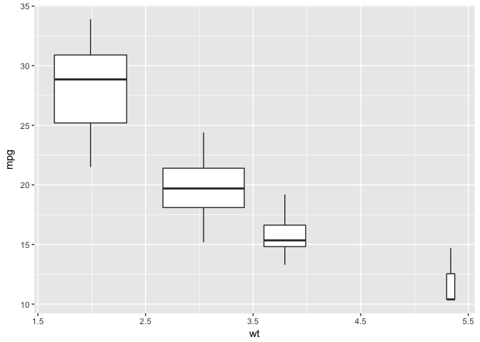

analyses example
================
JP
June 5, 2017

``` r
library(tidyverse)
```

    ## Loading tidyverse: ggplot2
    ## Loading tidyverse: tibble
    ## Loading tidyverse: tidyr
    ## Loading tidyverse: readr
    ## Loading tidyverse: purrr
    ## Loading tidyverse: dplyr

    ## Conflicts with tidy packages ----------------------------------------------

    ## filter(): dplyr, stats
    ## lag():    dplyr, stats

``` r
# data files
file_mtcars <- "../data/mtcars_data.rds"
```

Why do I need to back up (e.g., "../" if my getwd() indicates that I am already in the proper folder)???

``` r
ds <- read_rds(file_mtcars)
```

``` r
ds %>% 
  ggplot(aes(x = wt, y = mpg)) +
  geom_boxplot(aes(group = cut_width(wt, 1)), varwidth = TRUE)
```


